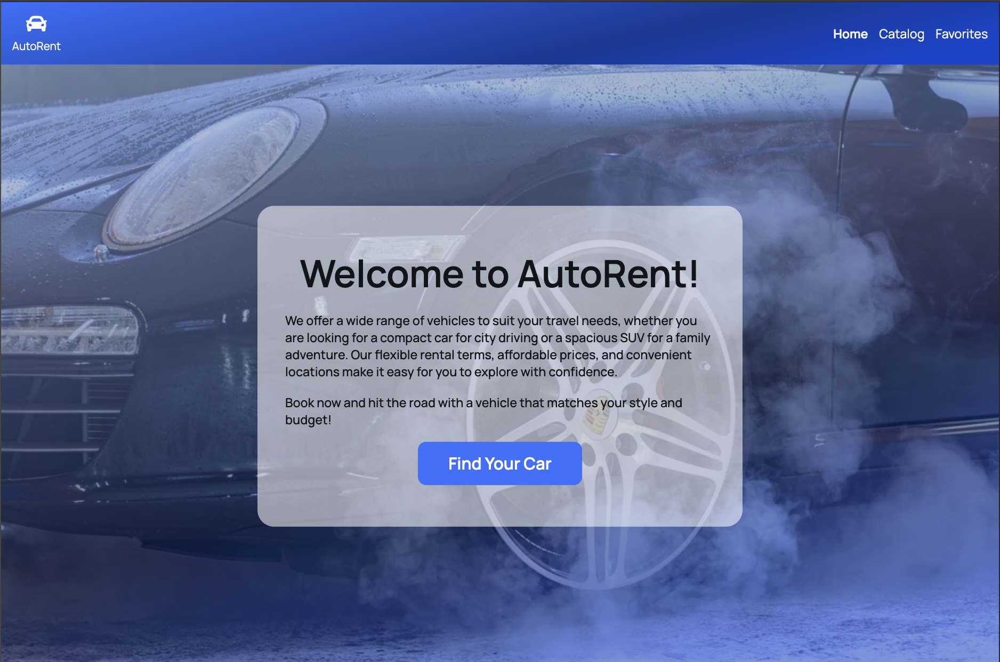

# AutoRent 🚙

[](https://car-booking-ten.vercel.app/)

## 

**AutoRent** is a car rental service offering a wide range of vehicles for any need. Users can easily search, filter, and book cars online, ensuring a smooth and convenient rental experience.

---

### Features

Once the application is up and running, users can:

- **Search and Filter**: Find cars by brand, model, production year, or mileage to match their specific needs.
- **Favorites List**: Add preferred cars to your favorites for quick access later.
- **Pagination Navigation**: Seamlessly navigate through search results with pagination for easier browsing.

---

### Getting Started

To set up and run the project locally, follow these steps:

1. Clone the repository:

```
git clone https://github.com/anna-vasylenko/car-booking.git
cd car-booking
```

2. Install project dependencies:

```
$ npm install
```

3. Start the Development Server:

```
npm run dev
```

---

### Project Structure

The project consists of the following main pages:

- **Home Page**: The landing page that introduces the service.
- **Catalog Page**: The page where users can browse, search, and filter through available cars.
- **Favorites Page**: A page to view and manage saved cars.
- **Car Modal**: A detailed view of the selected car with booking options.

**API Integration**
The app integrates with a mock API, created using [MockAPI][2], which provides data about available cars.

---

### Skills and Tools

- **React**
- **Redux Toolkit**
- **JavaScript (ES6+)**
- **HTML5 & CSS3**
- **Vite**: For fast bundling and hot reloading.
- **Vercel**: For seamless deployment and hosting.

---

[2]: https://mockapi.io/projects "MockAPI"
